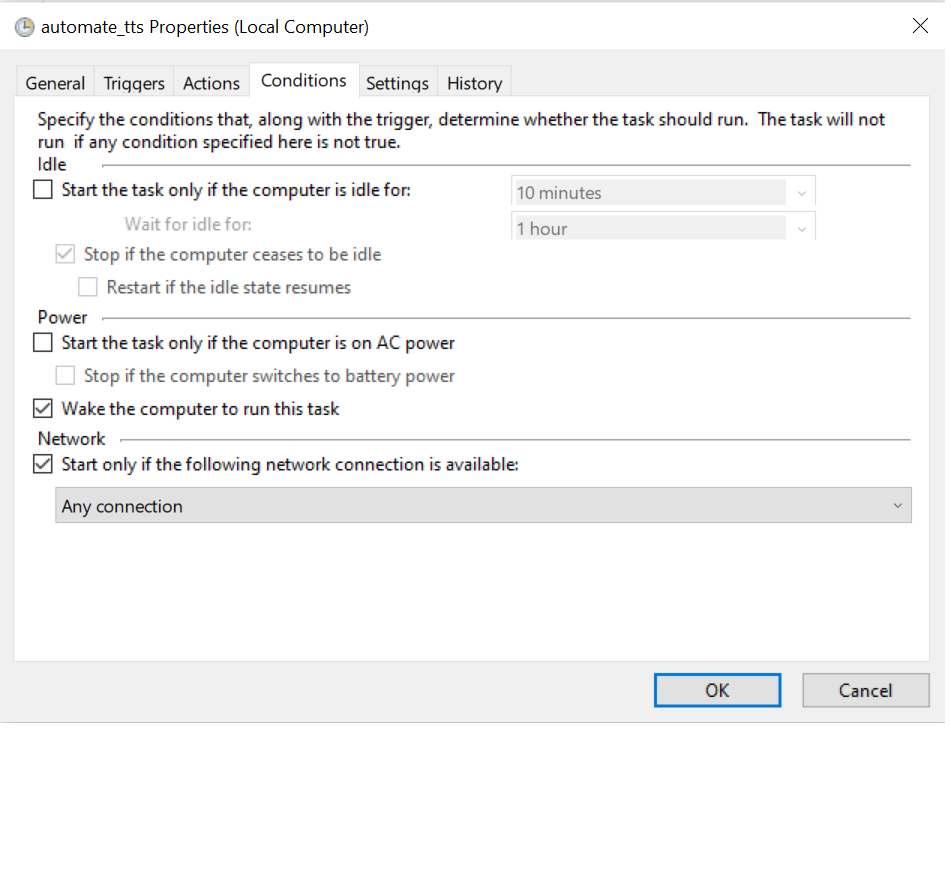
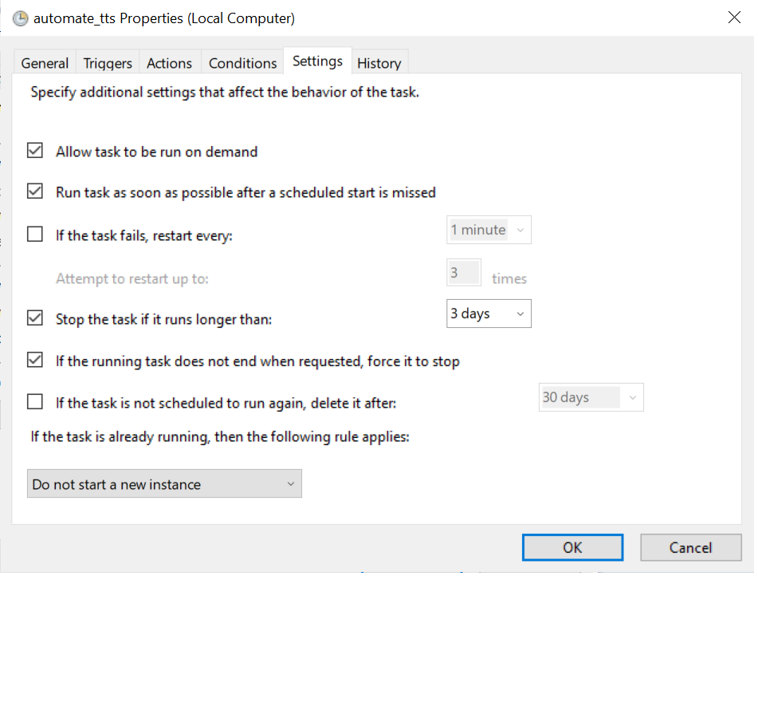

== Getting started

Hi if you're here that means you dont want to do tts and daily declaration everyday. 

=== Requirements 

Some requirements for this code is that it uses ChromeDriver which you would have to install (<<chrome_driver_link,link provided below>>) , and the guide uses the task scheduler in windows though I believe that there should be an equivalent for mac users 

=== Setup 
. install requirements
- This assumes that you already have python installed on your machine 

[source%nowrap, python]
----
pip install -r requirements.txt 
----

Actually you are only installing selenium when you do the above but I thought there would be 
more dependencies so oh wells.

. Install ChromeWebdriver 
You should follow this youtube video on how to install chrome driver, if you already have chrome driver because you worked with selenium before then you can skip this step.

===== youtube link
https://youtu.be/Xjv1sY630Uc?t=260

go to the file tts_auto.py and change the path to your driver(based on the video above)

[source%nowrap,python] 
----
PATH = "C:\Program Files (x86)\chromedriver.exe"
----

===== chromedriver website link 
https://chromedriver.chromium.org/downloads

=== running the file
open tts_auto.py file in your editor and change the password and username to whatever your sutd password and username is. 

[source%nowrap, python]
----
username = "Your student id"
password = "Your password here"
----

After setting your password your python script is all set! You are now able to test if your code is running by running the python script  

=== Scheduling the script to run at 7:00am everyday. 

You can follow this https://www.youtube.com/watch?v=n2Cr_YRQk7o[youtube video] to set it up: note the path to your file must be the path to your python file rather than the one shown in the tutorial video. 

Finally you have to set up the task scheduler to run the python script (Again this is only for windows soz!)

. go to your windows search and search task scheduler (and click it)

. At the right side of the task scheduler click create basic task 

. For name you can set it as automate_tts or anything else you want to call it, press next 

. Set trigger to daily, press next 

. Set the time you want your script to run everyday and recur every one day, press next 

. Select "start a program" option, press next

. For actions, Program/script you must set it to the path to your python.exe file (refer to the video above)

alternatively if you dont want to watch the video go to command prompt and type python then enter

Afterwards type these commands
[source%nowrap, python]
----
import sys 
print(sys.executable)
----
copy whatever comes out and paste into the program/script part 

for the arguments paste the path to the tts_auto.py file 

Example path(the path I used)
[source%nowrap,python]
----
"C:\Users\65945\Documents\Projects\tts_auto\tts_auto.py"
----

Finally after you complete the setup, go to active task, find the task that you just created using the name you set and click on it. 

Set up the conditions and settings of the task as follows 

After youre done, go back to the task scheduler, click the task you created in active task and test it out by pressing the run button at the side, if it works, and you set the conditions and settings as per above, your thing should run everyday.

Awesome, you're done and congratulations, sutd_is_the_best and thank you very much ^^

